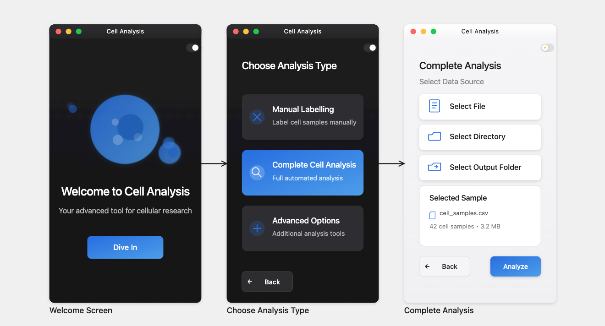

# Cell Analysis Application

## Version 1.0.0 (Initial Release)

### Overview
Cell Analysis Application is an advanced, open-source tool designed for researchers and scientists specializing in cellular imaging and analysis. Built with Python and PyQt6, this application provides a comprehensive suite of tools for cell sample investigation.



### Features
- 🔬 **Advanced Cell Visualization**
- 🖌️ **Manual Cell Labeling**
- 🎨 **Dark and Light Theme Support** *(Early Access)*
- 📊 **Intelligent Frame Selection** *(Early Access)*
- 🔄 **Flexible Analysis Modes** *(Early Access)*

> **Prototype Note:** Currently limited in scope. Expect significant improvements and expanded functionality in upcoming releases.

### Installation

#### Prerequisites
- Python 3.8+
- pip package manager

#### Dependencies
```bash
pip install PyQt6 numpy opencv-python pillow scikit-image
```

#### Clone the Repository
```bash
git clone https://github.com/kiransandilya/HMS_MGH_WBC.git
cd Cell_Analysis_Tool
```

#### Install Requirements
```bash
pip install -r requirements.txt
```

### Running the Application
```bash
python main.py
```

### Key Screens

#### 1. Welcome Screen
- Animated cell visualization
- Theme toggle
- Initial application entry point

#### 2. Analysis Type Selection
Choose from:
- Manual Labelling
- Complete Cell Analysis
- Advanced Options

#### 3. File Selection
- Select individual files or directories
- Configure output locations
- Prepare for analysis

#### 4. Manual Labeling Interface
- Advanced mask creation tools
- Frame-by-frame navigation
- Intelligent frame selection *(Early Access)*

### Supported File Formats
- TIFF/TIF image stacks
- Various image formats supporting cell analysis

### Prototype Limitations
- Some features are in early development stages
- Functionality may be inconsistent
- Not all planned capabilities are fully implemented

### Planned Features (Future Versions)
- [ ] Machine learning-assisted labeling
- [ ] Enhanced analysis algorithms
- [ ] Cloud synchronization
- [ ] Advanced visualization tools
- [ ] Sessions, easy save and load
- [ ] Comprehensive feature stabilization

### Contributing
1. Fork the repository
2. Create your feature branch (`git checkout -b feature/AmazingFeature`)
3. Commit your changes (`git commit -m 'Add some AmazingFeature'`)
4. Push to the branch (`git push origin feature/AmazingFeature`)
5. Open a Pull Request

### System Requirements
- **Operating Systems:** 
  - Windows 10/11
  - macOS 10.15+
  - Linux (Ubuntu 20.04+)
- **Minimum Hardware:**
  - 8GB RAM
  - Dual-core processor
  - Graphics card with OpenGL 3.3+ support


### Acknowledgments
- [PyQt6](https://www.riverbankcomputing.com/software/pyqt/)
- [OpenCV](https://opencv.org/)
- [NumPy](https://numpy.org/)

---

## Changelog

### [1.0.0] - Initial Release Date
#### Added
- Welcome screen with theme toggle
- Analysis type selection
- Manual labeling interface
- File and directory selection
- Basic cell visualization
- Early access features

#### Fixed
- Initial stability improvements
- Basic error handling

### Upcoming in Version 1.1.0
- Performance optimizations
- Additional file format support
- Enhanced error reporting
- Feature stability improvements


### Contact
Fill this out:
https://tinyurl.com/ycyybe4m
